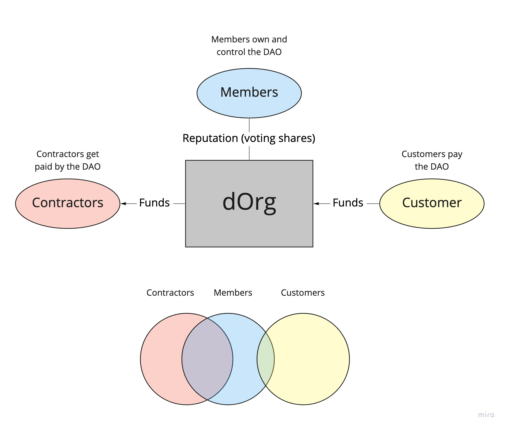

Blockchain Based LLC (BBLLC) Q&A
--------------------------------

*DISCLAIMER: The material provided in this document is for general
information purposes only. It is not intended to provide legal advice or
opinions of any kind and may not be used for professional or commercial
purposes. No one should act, or refrain from acting, based solely upon
the materials provided in this document, any hypertext links or other
general information without first seeking appropriate legal or other
professional advice. All information in this document are provided for
your convenience only. These materials may have no evidentiary value and
should be checked against official sources before they are used for
professional or commercial purposes. It is your responsibility to
determine whether these materials are admissible in a given judicial or
administrative proceeding and whether there are any other evidentiary or
filing requirements. Your use of these materials is at your own risk.*

Recently, dOrg incorporated in Vermont as a BBLLC. This legal structure
allows a DAO to operate as a legal entity. Additional information and
background can be seen here:
[https://github.com/dOrgTech/LL-DAO](https://github.com/dOrgTech/LL-DAO).
Below are answers to various questions you might have regarding the dOrg
incorporation process:

-   What is the background of dOrg?

    -   dOrg is structured as a cooperative of freelancers, created to enjoy economies of scale while maintaining freelancer independence. dOrg started as a spinoff of the [Genesis DAO](https://medium.com/daostack/tagged/genesis-dao) community around December, and developed a business model to fund themselves through client software development work, helping companies & teams with [DAOstack](https://daostack.io/) integrations.

-   Why should a DAO incorporate?

    -   [Limited Liability](https://en.wikipedia.org/wiki/Limited_liability): There's a big issue with debt and other legal liabilities for unincorporated DAOs. As an unincorporated entity, any member could create debts for the entire collective. This exposes every member to debts & liabilities caused by any other member, which is not a good thing.

    -   [Legal Capacity](https://en.wikipedia.org/wiki/Capacity_(law)): In addition, unincorporated DAOs have a hard time entering into legal agreements with existing legal entities. Incorporating gives the DAO the ability to enter into legal contracts, to sue and to be sued.

-   How long did dOrg's legal process take?

    -   2-3 months

    -   During this time, dOrg and its legal advisors worked out a lot of details that other projects might not need to work out now. Learned a lot that should make process for new teams easier and less expensive.

    -   An entity can be registered through Vermont's online portal in as little as 1-3 business days.

-   What were dOrg's objectives?

    -   Limited Liability, Legal Capacity

        -   Shield members from personal liability

            -   Not liable for other members' actions

            -   Not liable for the entity's debts

            -   Personal assets are not at risk

        -   Fluidly interoperate with other individuals and legal
            > entities

            -   Allow contributors to come and go

            -   Give other legal entities (Clients, Partners, & Service Providers) a point of contact for financial agreements

    -   Minimize admin overhead (paperwork, fees, official titles, board meetings, lawyers, accountants) and any interfacing with legal docs/system

        -   Handle all potentially contentious processes on-chain

        -   Including the processes for changing processes

        -   No need to update documents as new members are added or removed

-   What are dOrg's Ownership / Governance goals?

    -   dOrg aimed to give its worker-members full control of the entity in a meritocratic, non-hierarchical fashion. The more value a member contributes to the company, the higher their reputation (voting power).

    -   As for ownership, dOrg is currently owned entirely by its worker-members. Revenues that come into the entity are allocated over time through proposals to members, contractors, and third party service providers.

-   Does dOrg's legal entity have shareholders?

    -   The owners of an LLC are referred to as "Members". Currently there are no external investor owners, only worker-members

    -   Anyone with any amount of Rep is considered to have 1 share of the company

-   Can the BBLLC issue out dividends?

    -   Shares are not considered a means of profit-sharing. In dOrg's case, the entity is designed to be zero-profit. The LLC itself won't pay taxes because there won't be profits. The only way to get money out of the DAO is through proposals.

-   Does the legal entity have a board of directors?

    -   No it does not. The reputation holders are the ultimate decision-makers. Nothing above or beyond that.

-   Who would represent this legal entity in court?

    -   dOrg can define administrative member(s) to act as a centralized point of contact for formal roles such as filing legal documents, maintaining a mailing address, appearing in court, etc. Members have the ability to update who this person is at any time.

-   Is there KYC requirements for the DAO?

    -   US LLCs don't have KYC requirements for owners. Ownership can be completely anonymous.

    -   The only thing you need identifying information for is taxes, so you'd only need that to issue the [1099s](https://www.debt.org/small-business/what-are-1099s/) to people the DAO is paying.

    -   For customers of the DAO, it has to follow the same guidelines that any other business would when dealing with customers.

-   Are there any restrictions on who dOrg is able to work with?

    -   Just like a normal corporation, dOrg needs a tax ID of businesses it deals with.

    -   Corporations from countries that the US has trade sanctions on would not be able to do business with dOrg at this time.

-   What are the roles within dOrg's DAO?

    -   Contractors - get paid by the DAO (agree to *Contractor Terms & Conditions*)

    -   Members - hold reputation in the DAO (agree to [Operating Agreement](https://app.openlaw.io/template/bbllc-dao%20-%20vermont))

    -   Customers - pay the DAO (agree to *Customer Terms & Conditions*)

{width="4.8473534558180225in"
height="4.109375546806649in"}

-   What happens if someone steals from the DAO?

    -   If someone attempts to defraud the DAO or breach existing agreements, then there is legal recourse to sue.

-   Can a DAO incorporate in any other States other than Vermont?

    -   Technically, yes. See here for an example of a [New York LLC-DAO](https://app.openlaw.io/template/llc-dao%20operating%20agreement%20(ny)).

    -   Vermont explicitly created legislation to create a new legal entity classification called the BBLLC, that permits companies to manage governance, ownership and conduct material operations on a blockchain. This provides certainty that other jurisdictions lack.

    -   The risk in incorporating in another State is that the legal system may not have categories or accept the legitimacy of the DAO governance decisions.

-   Does the DAO need to file taxes?

    -   Just like any other company, dOrg needs to file taxes

    -   Members will pay self-employment taxes according to their own jurisdictions

-   Are your incorporation documents publicly available?

    -   Yes, they are [here](https://app.openlaw.io/template/bbllc-dao%20-%20vermont).

-   What is the benefit of LLC?

    -   Super lightweight

    -   Low admin requirements (annual report)

-   What are possible variations in these legal documents that might be popular?

    -   dOrg spent months fine-tuning all the legal agreements so that full power would be vested in the reputation holders as dictated by the community governance engine (DAOstack's Alchemy Earth).

    -   LLCs are very flexible, so any variations to the above could be specified in an entity's formation documents (Operating Agreement)

    -   dOrg also chose to use DAOstack, but this approach could work for any DAO-like protocol if explained properly in the formation documents.

-   Do you recommend people using these legal documents as-is?

    -   No, these documents are meant to serve as a useful starting point for others, but each DAO will have its own design goals and considerations.

    -   If interested in speaking with us about the technical, economic or legal aspects of starting your own DAO, feel free to contact dOrg on [Discord](https://discord.gg/6Kujmad) or at contact@dorg.tech.

-   Are there any challenges you are currently running into?

    -   UX for maintenance / operational / admin activities

        -   For example, a new client comes on and signs new service agreement with them. Right now, this would require putting a document in github, then create proposal to pass it within alchemy

    -   Requiring a bank account to receive payments from other traditional corporations

-   Next steps

    -   Software, templates, and guidelines to make legal DAO formation and maintenance easier.
